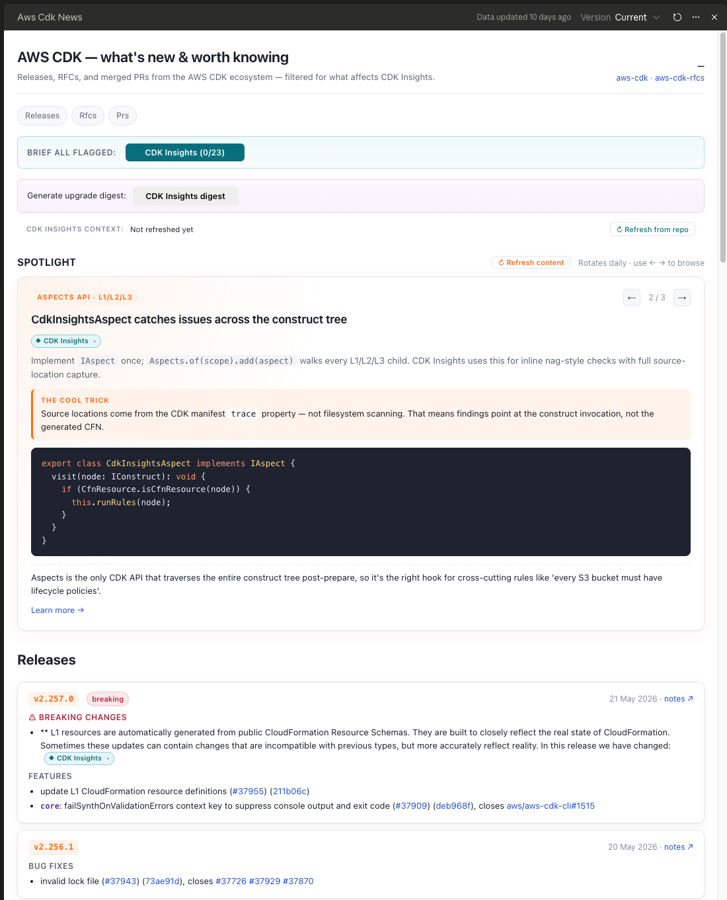
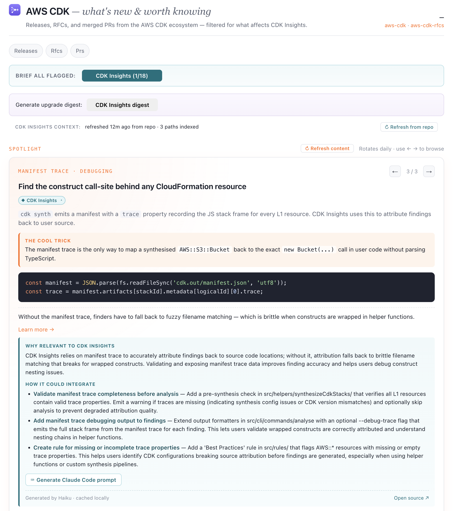
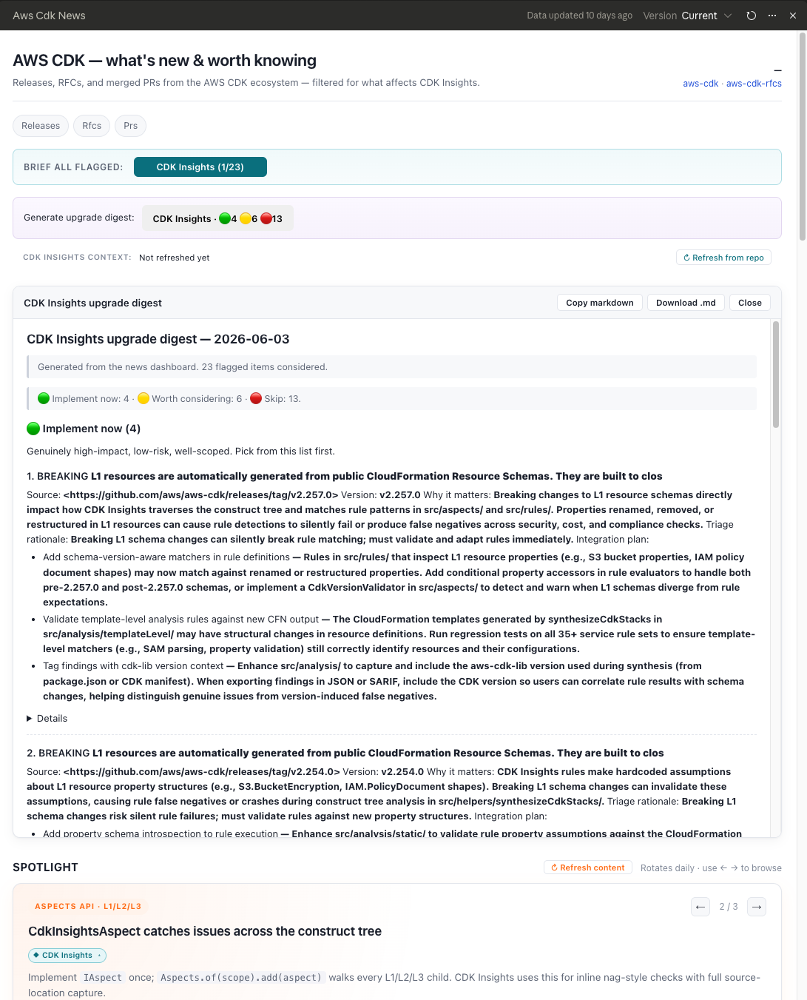

<p align="center">
  
</p>

<h1 align="center">Foresights</h1>

<p align="center">
  News that affects your stack — before it lands.<br/>
  A Claude Code &amp; Cowork plugin by <a href="https://instancelabs.dev">Instance Labs</a>.
</p>

---

Foresights spins up a news dashboard customised to your product in about 15 minutes. It shows just the GitHub releases, PRs, RFCs, and RSS items that touch *your* stack — plus curated highlights, a rotating spotlight, and per-product relevance flagging so you see what matters immediately.

When something is worth acting on, click through to a Haiku-generated brief grounded in *your* codebase, then generate a self-contained Claude Code prompt to implement it — or batch everything into a triaged upgrade digest that drops into your repo's `.claude/upgrade-digests/` folder.

<p align="center">
  
  
  
</p>

## See it first

▶ **[Open the live demo in your browser](https://htmlpreview.github.io/?https://github.com/instancelabs/foresights/blob/main/foresights/demo/static-aws-cdk-news.html)** — a self-contained AWS CDK news dashboard, nothing to install. (Or open `foresights/demo/static-aws-cdk-news.html` locally.)

It's a structural preview — the live data, brief panels, and digest workflow fire once you build your own with `/create-dashboard`.

## Requirements

- **[Claude Code](https://claude.com/claude-code)** (the CLI) **or Cowork** (the Claude desktop app's workspace for live, interactive artifacts) — Foresights runs in either.
- **Node ≥ 20** — the wizard compiles your dashboard locally. `/foresights-doctor` verifies this for you.
- A connected **GitHub MCP server** *if* you want live GitHub release / PR / issue data — optional; RSS-only and curated-only dashboards work without it.
- Brief generation uses **Claude Haiku**, so expect a small amount of model usage.

## Install &amp; first run

### In Claude Code

```
/plugin marketplace add instancelabs/foresights
/plugin install foresights@instancelabs
```

Then run **`/create-dashboard`** and answer ~6 quick questions (topic, accent, data sources, products to flag, spotlight seeds, cadence). You get a **self-contained static HTML dashboard** that opens in any browser.

### In Cowork

Drag-install the latest `.plugin` from the [releases page](https://github.com/instancelabs/foresights/releases) (or build it yourself — see [Building from source](#building-from-source)), then run **`/create-dashboard`**. In Cowork you get a **live artifact** that re-fetches GitHub / RSS data every time you open it.

> **Two output modes, picked automatically.** Cowork → a live artifact that re-fetches on open. Claude Code → a static HTML file baked once, portable and shareable. The wizard detects your host; you can force either.

On a locked-down or corporate machine? Run **`/foresights-doctor`** first — it probes your environment and routes the wizard to the data path that works there (down to a fully curated-only dashboard when no network path is available).

## What's installed

**Start with `/create-dashboard`** — the rest support it.

| Skill | What it does |
|---|---|
| **`/create-dashboard`** | *Start here.* Wizard (~6 questions) that generates your dashboard — live ecosystem news (GitHub releases / PRs / issues + RSS / Atom feeds), curated highlights, a rotating spotlight, per-product relevance flagging, briefs, and the upgrade-digest builder. |
| `/refresh-dashboard` | Re-curate the highlights, patterns, tips, and resources on an existing dashboard against the latest live data — a fast section-splice, escalating to a full rebuild when the spotlight, sources, or products change. |
| `/setup-cc` | Generate the `CLAUDE.md` additions, `.claude/upgrade-digests/` scaffold, and `/digest` + `/digest-save` commands in a target repo — closes the loop from dashboard → digest → Claude Code → PR. |
| `/foresights-doctor` | Diagnostic. Seven cheap checks (Node version, wizard entrypoints, network reachability, GitHub MCP detection, …) that confirm the install is healthy and route `/create-dashboard` to the right data path. Run it before your first build in a new environment. |
| `/foresights-design` | *(For builders.)* The Foresights brand + design system as an invokable skill — drop-in tokens, components, brand guidelines, and UI-kit references for on-brand dashboards or marketing material. |

Each flagged product carries one of three **action types** — `claude-code` (the default; ready-to-run handoff prompt + upgrade-digest workflow, for products backed by a code repo), `summary` (plain prose, for research / marketing products with no repo), or `task` (a tracker-ready checklist). Pick the type per product during the wizard.

## How it works — the 5-layer architecture

Every generated dashboard follows the same proven pattern:

1. **Live data** — GitHub releases / PRs / issues via the MCP bridge, plus RSS / Atom feeds baked at build time. Refreshed each time you open the dashboard (artifact mode) or pre-baked into the file (static mode).
2. **Curated content** — hand-picked highlights, a rotating spotlight (daily / weekly / on-demand), community libs, tips, and resources. Each section has a `↻ Refresh content` button driven by `/refresh-dashboard`.
3. **Relevance flagging** — regex matchers per product flag items that affect *your* stack. Items can carry multiple product badges; matchers are stress-tested at build time for catastrophic-backtracking patterns.
4. **Brief panel** — click any badge → a Haiku-generated "why relevant" + "how it could integrate," with specific src paths from your repo, cached locally by content hash.
5. **Implementation** — every brief has a Claude Code prompt button (or a summary / task output, depending on the product's action type). A per-product "Upgrade digest" button batches all flagged items into 🟢/🟡/🔴 triage buckets with embedded ready-to-paste prompts. `/setup-cc` wires the receiving side into your repo.

**A note on privacy:** dashboards cache briefs and (optionally) your repo's `CLAUDE.md` / `README.md` text in the browser's `localStorage` — all local, no telemetry, no analytics. Clear the `${topicSlug}-news.*` keys before sharing a dashboard widely. Full detail in the [plugin README](./foresights/README.md#whats-stored-locally).

## Status

**v0.9.9 — actively maintained.** Latest: Claude Code (static-output) support alongside Cowork, plus a security-hardening pass — `safeHref` on every link, a build-time XSS allowlist on trusted-HTML fields, an SSRF guard on feed fetches, and a regex-DoS smoke check; `npm audit` is clean. Full per-version notes on the [releases page](https://github.com/instancelabs/foresights/releases).

## Building from source

The repo keeps `foresights/templates/` at the root of the plugin source for ergonomic local dev (`npm install` / `npm run preflight` run from there). The build script stages a clean copy with `templates/` relocated under `skills/create-dashboard/templates/` (where SKILL.md's `${CLAUDE_PLUGIN_ROOT}` path points), strips cruft, runs three completeness guards (precompiled wizard entrypoints present, every relative TS import resolves, only `esbuild-wasm` in `node_modules/`), and zips it.

```bash
bash scripts/build-plugin.sh
```

Produces `foresights-<version>.plugin` at the repo root. Version comes from `foresights/.claude-plugin/plugin.json`; override with a positional arg (`bash scripts/build-plugin.sh 0.9.4-pre`).

---

Author: [Instance Labs Ltd](https://instancelabs.dev). Licensed under [MIT](./LICENSE).
